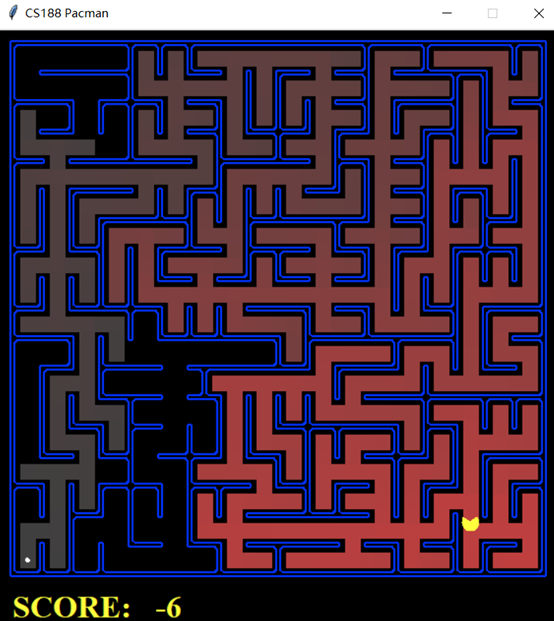

# Pacman

AI automatically finds out the shortest distance to the target location within a maze.
### Preview

### Motivation
This project is one of the course projects from Artificial Intelligence course at UC Berkeley.  Utilizing what I learned from the graph search algorithms I can apply it on the Pacman game.  Pacman is set to use the A* search with heuristic of manhattan distance.  It makes senese since Pacman can only move in 4 directions and the closer to the food the better.  After then I learned that there is better heuristic function so that Pacman can search for food in a shorter time.  It is essential for me because I have learned a lot from this fun project about artifical intelligence.

### Description
- Implemented parts of the existing Pacman game engine using Python.
- Applied A star graph search algorithms to allow Pacman to automatically search for foods in the maze.
- Applied optimization using better heuristic function to improve time complexity.

### Skills to learn
- Python
- Artificial Intelligence
- Object-Oriented Design

